EngLife
======
This repository will be used for our application named "EngLife" that will be completed for the SOEN341 course, section SA.

Project Description
=======

Objective 
------
Develop an application that is inspired by the functionality of Instagram, but for the students of Concordia, specifically the Gina Cody, school of engineering faculty.

Project
------
There are a plethora of social media platforms that are used by students around the globe. However, this
is the first social media of its kind that is intended for local users or more specifically, engineers
attending Concordia University.

Team Members 
------
  * Anthony Chraim (Team Leader) //TonyMontana11
  * Cedrik Dubois // purplesmurf1998
  * Daniel Jean Sol-Esguerra // danielxjean
  * Kevin Rao // KevKevR
  * Mohammad Amin Solki //amins2020

Languages and Technologies
------
  * Android Studio
  * SQLite
  * Java
  * Firebase & Firestore
  * Flutter 
  * Dart

Core Features
------
  * Allow users to post pictures
  * Allow users to follow one another
  * Allow users to leave comments on picture posts

Screenshots
------
Logging in as a user or group

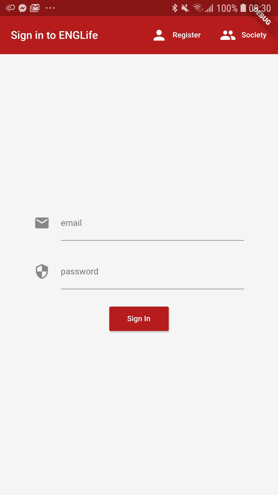

Signup as a user, or signup as a group (requires ECA password)

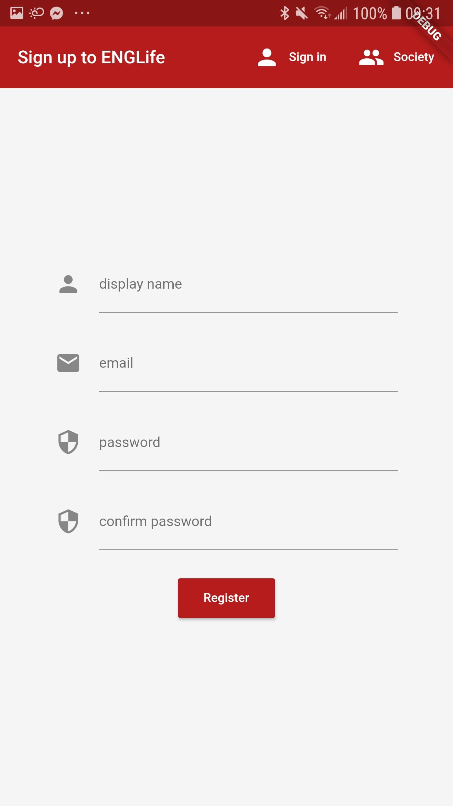 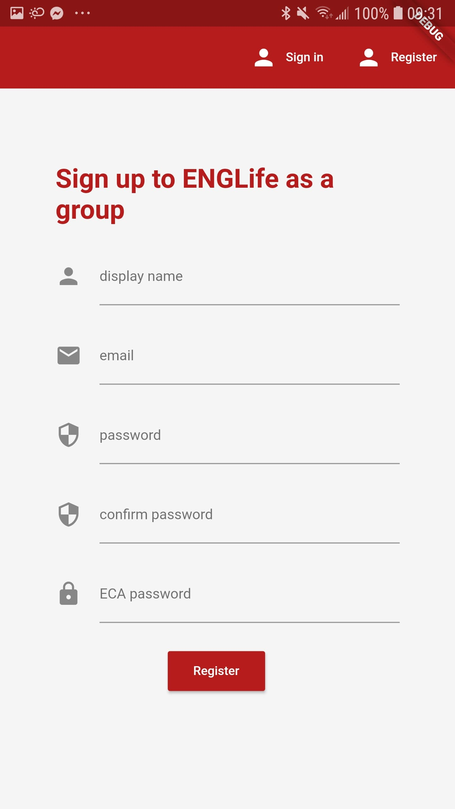

Once registered, if it's your first time, you are redirected to the groups page so that you may choose which group you wish to follow

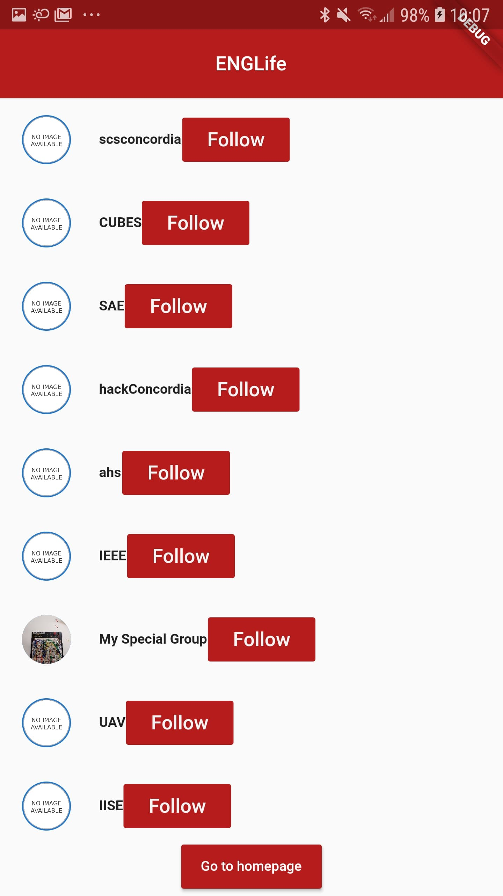

Friend feed and group feed (can toggle in between with button top right corner)

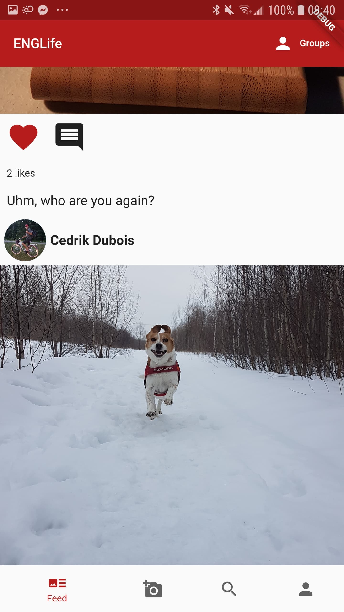 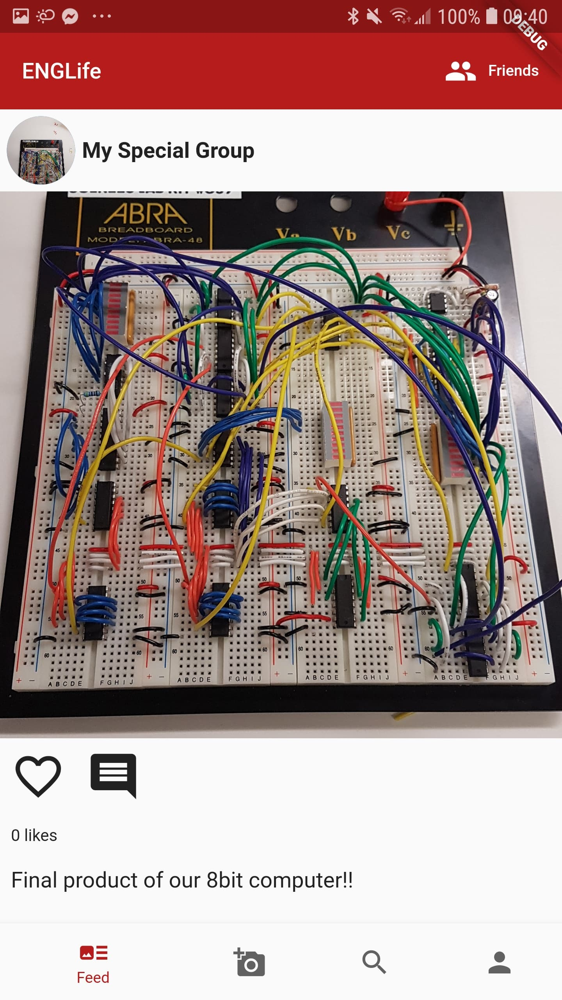

Add photo page

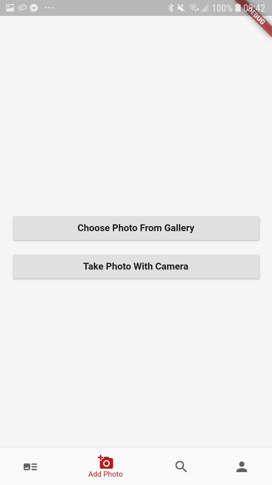

Search page that dynamically changes the list as user starts searching

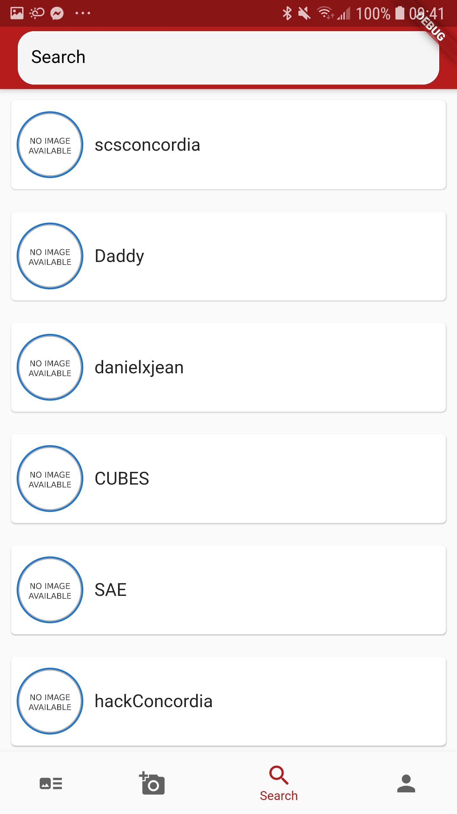 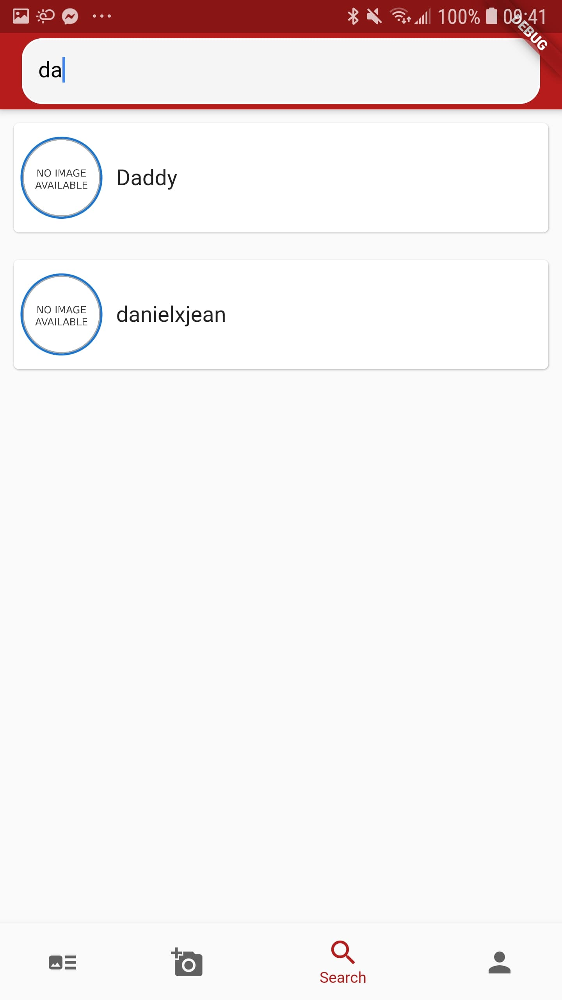

Comments page for every post

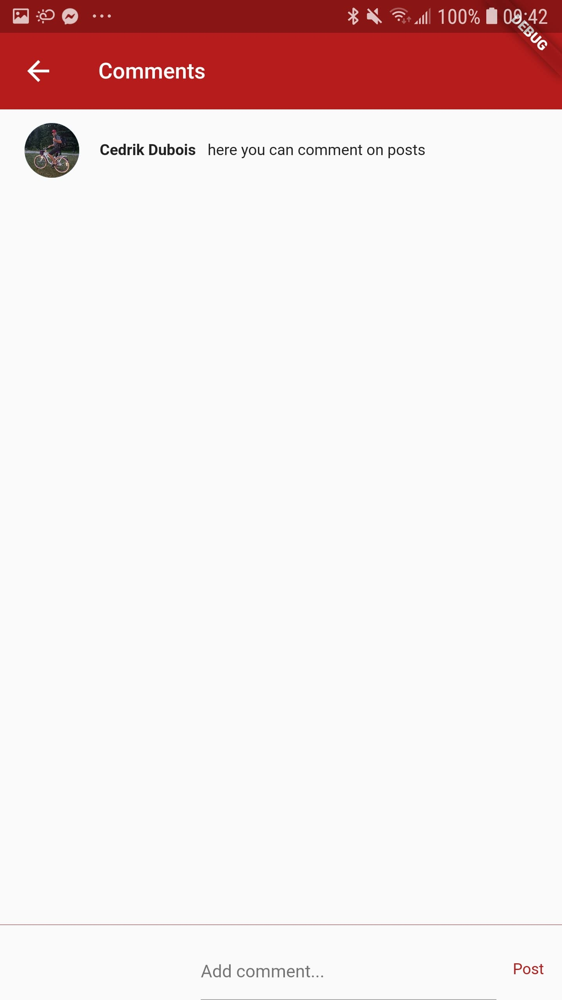

Other user profiles you can view and follow, and the user's own profile which they can edit

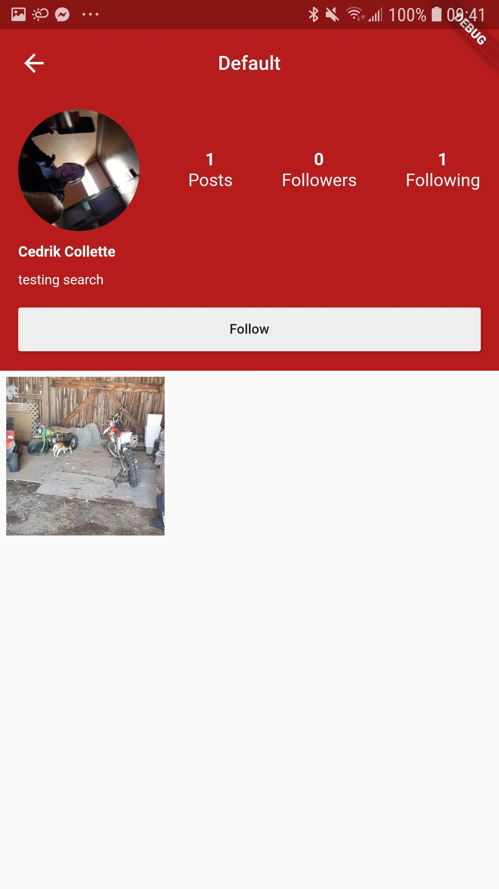 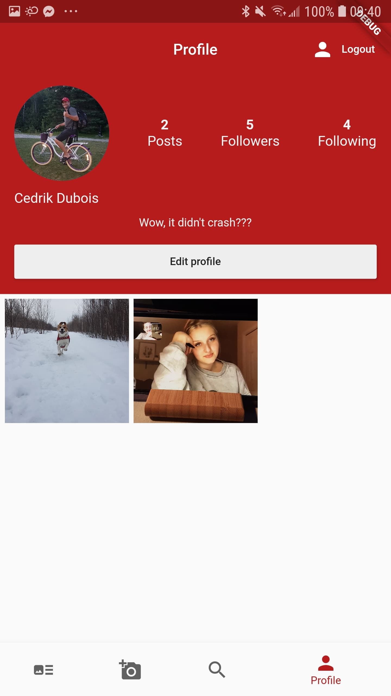

Editing page for your profile

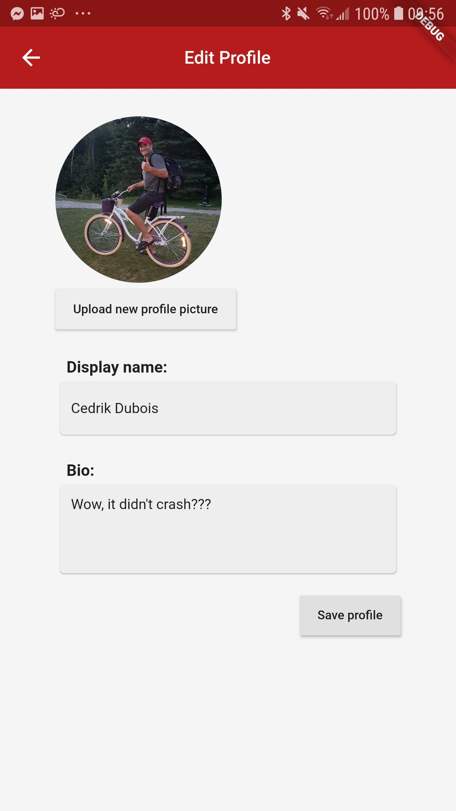
